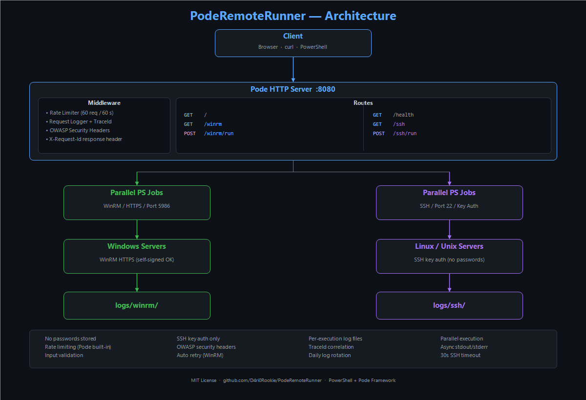

# PodeRemoteRunner

**Run PowerShell commands on multiple remote servers in parallel.**

[](https://github.com/PowerShell/PowerShell)
[](https://github.com/Badgerati/Pode)
[](LICENSE)
[](https://www.microsoft.com/windows)

</div>

Execute commands on **Windows servers via WinRM** and **Linux servers via SSH** from a single HTTP interface. Includes a web UI and a REST API.



---

## Features

- **Parallel execution** — all target servers run simultaneously, not one by one
- **WinRM** — execute PowerShell on Windows servers over HTTPS (port 5986)
- **SSH** — execute commands on Linux/Unix servers with key-based authentication
- **Web UI + REST API** — use the browser or call the API directly from scripts
- **Per-request TraceId** — every request gets a unique ID for log correlation
- **Per-execution log files** — each run saves command and output to its own file
- **Rate limiting** — 60 requests per minute per IP (Pode built-in)
- **OWASP security headers** — CSP, X-Frame-Options, X-Content-Type-Options, and more

---

## Quick Start

**1. Install Pode:**
```powershell
Install-Module -Name Pode -Scope CurrentUser
```

**2. Run setup** (checks requirements, creates the `logs/` folder):
```powershell
.\scripts\setup.ps1
```

**3. Start the server:**
```powershell
.\server.ps1
```

Open `http://localhost:8080` in your browser.

---

## API

| Method | Endpoint | Description |
|--------|----------|-------------|
| `GET` | `/` | Server status page |
| `GET` | `/health` | Health check |
| `GET` | `/winrm` | WinRM web UI |
| `POST` | `/winrm/run` | Execute PowerShell via WinRM |
| `GET` | `/ssh` | SSH web UI |
| `POST` | `/ssh/run` | Execute commands via SSH |

The `X-Request-Id` response header contains the TraceId for every request. Use it to find the matching log file.

### POST /winrm/run

```json
// Request
{
  "servers": ["SERVER01", "SERVER02"],
  "command": "Get-Service W3SVC | Select-Object Name, Status"
}

// Response
{
  "success": true,
  "executionId": "a1b2c3d4",
  "logFile": "logs/winrm/execution_2025-08-28_14-30-15_a1b2c3d4.log",
  "results": [
    {
      "server": "SERVER01",
      "success": true,
      "output": "Name  Status\n----  ------\nW3SVC Running",
      "error": ""
    }
  ]
}
```

### POST /ssh/run

```json
// Request
{
  "hosts": ["ubuntu-01.example.com", "192.168.1.20"],
  "username": "admin",
  "command": "df -h"
}

// Response
{
  "success": true,
  "executionId": "a1b2c3d4",
  "results": [
    {
      "host": "ubuntu-01.example.com",
      "success": true,
      "output": "Filesystem  Size  Used Avail Use% Mounted on\n/dev/sda1    50G   12G   36G  25% /",
      "error": "",
      "executionTime": 1.23
    }
  ]
}
```

---

## Prerequisites

### WinRM (Windows targets)

Enable WinRM HTTPS on each target server:
```powershell
winrm quickconfig -transport:https
```

Add the service account to the **Remote Management Users** group on each target, then test:
```powershell
Test-WSMan -ComputerName "YOUR-SERVER" -UseSSL
```

### SSH (Linux targets)

OpenSSH must be installed on the machine running PodeRemoteRunner:
```powershell
Get-Command ssh.exe   # must return a path
# If missing:
Add-WindowsCapability -Online -Name OpenSSH.Client~~~~0.0.1.0
```

Copy your public key to each Linux host:
```bash
ssh-copy-id admin@linux-host-01
```

The key defaults to `~/.ssh/id_rsa`. Change `$SSH_KEY_PATH` at the top of `routes/ssh.ps1` to use a different key.

---

## Project Structure

```
PodeRemoteRunner/
├── server.ps1                   # Main HTTP server
├── start-background.ps1         # Run server in background
├── scripts/
│   ├── setup.ps1                # Requirements check and setup
│   └── generate-image.ps1       # Regenerate image.png
├── routes/
│   ├── health.ps1               # GET /health
│   ├── winrm.ps1                # GET /winrm  POST /winrm/run
│   └── ssh.ps1                  # GET /ssh    POST /ssh/run
└── logs/                        # Auto-generated (gitignored)
    ├── server-YYYY-MM-DD.log
    ├── requests-YYYY-MM-DD.log
    ├── winrm/                   # Per-execution WinRM logs
    └── ssh/                     # Per-execution SSH logs
```

---

## Troubleshooting

Find any request by its TraceId across all logs:
```powershell
Get-ChildItem "logs\" -Recurse -Filter "*.log" | Select-String "a1b2c3d4"
```

| Problem | Solution |
|---------|----------|
| WinRM connection refused | Run `winrm quickconfig -transport:https` on the target |
| WinRM access denied | Add the user to **Remote Management Users** on the target |
| WinRM SSL error | Run `winrm enumerate winrm/config/listener` — check the certificate |
| WinRM timeout | Verify port 5986 is open in the firewall |
| `ssh.exe` not found | `Add-WindowsCapability -Online -Name OpenSSH.Client~~~~0.0.1.0` |
| SSH permission denied | Run `ssh-copy-id user@host` from the server machine |
| SSH connection timed out | Verify port 22 is open and the host is reachable |
| Port 8080 in use | Stop the existing process or change the port in `server.ps1` |

---

## Security

- **No passwords stored** — WinRM uses Windows integrated authentication; SSH uses private key files only
- **Input validation** — server names and hostnames are sanitized before use
- **Rate limiting** — 60 requests per minute per IP address
- **OWASP headers** — CSP, X-Frame-Options, X-Content-Type-Options, Referrer-Policy, Permissions-Policy on every response

---

## License

MIT — see [LICENSE](LICENSE)

**Dependencies:** [Pode Framework](https://github.com/Badgerati/Pode) (MIT) · Windows Remote Management · PowerShell 5.1+
